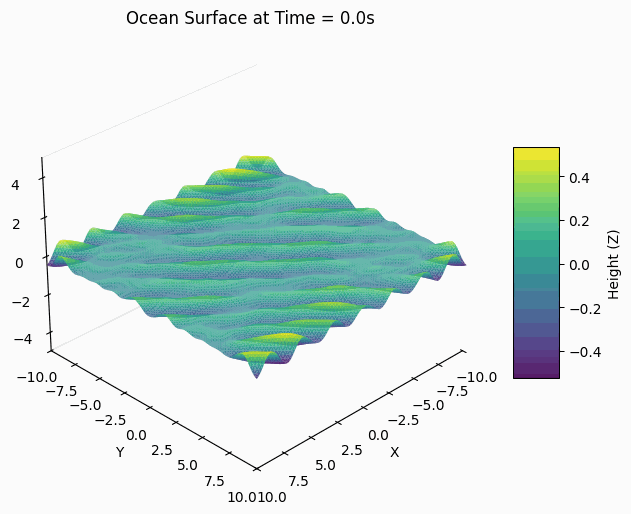

# Ocean Generator

A command-line tool for generating tessellated 2D plane-like meshes with customizable parameters and trochoidal wave simulation.

## Features

- Generate 2D plane meshes with customizable dimensions and resolution
- Apply random noise/perturbation to create uneven surfaces
- Simulate realistic ocean waves using trochoidal (Gerstner) wave equations
- Control wave parameters like amplitude, wavelength, steepness, and direction
- Export to multiple formats (OBJ, STL, GLB, RAW)
- Output to file or stdout

## Demonstration

Below is an animation generated using the Python script `generate_ocean_animation.py` included in this repository. It showcases the ocean surface with realistic wave patterns generated by this library:



The animation demonstrates how the ocean surface evolves over time using the trochoidal wave simulation with parameters:
- Wind speed: 5.0 m/s
- Wave amplitude: 1.5
- Choppiness: 0.5

## Installation

Ensure you have Rust and Cargo installed, then build the project:

```bash
cargo build --release
```

The binary will be available at `target/release/ocean-generator`.

## Usage

### As a Library

Ocean Generator can be used as a library in your Rust projects:

```toml
# In your Cargo.toml
[dependencies]
ocean-generator = { git = "https://your-repo-url.git" }
```

Then in your code:

```rust
use ocean_generator::prelude::*;
use ocean_generator::wave;

fn main() {
    // Create a mesh
    let mut mesh = Mesh::new_plane(
        10.0,  // width
        10.0,  // length
        20,    // width segments
        20,    // length segments
        0.0,   // noise
    );
    
    // Add wave simulation
    let wave_params = wave::generate_wave_params(
        3,       // number of wave components
        0.5,     // amplitude
        2.0,     // wavelength
        0.5,     // steepness
        45.0,    // direction in degrees
        42,      // random seed
    );
    
    mesh.apply_waves(&wave_params, 0.0);  // Apply waves at time=0.0
    
    // Export the mesh
    let format = ExportFormat::Obj;
    let mut file = std::fs::File::create("ocean.obj").unwrap();
    export_mesh(&mesh, format, &mut file).unwrap();
}
```

### As a CLI Tool

```bash
# Generate a basic 10x10 mesh with 10 segments in each direction (default)
ocean-generator

# Generate a 20x30 mesh with 20x15 segments
ocean-generator --width 20 --height 30 --width-segments 20 --height-segments 15

# Add some noise/perturbation to create an uneven surface
ocean-generator --noise 0.3

# Add trochoidal wave simulation with default parameters
ocean-generator --waves

# Customize wave parameters
ocean-generator --waves --amplitude 0.8 --wavelength 3.0 --steepness 0.7 --direction 30.0

# Use multiple wave components for more complex ocean surface
ocean-generator --waves --wave-count 5

# Set a specific time parameter for wave animation
ocean-generator --waves --time 2.5

# Use a custom random seed for reproducible wave patterns
ocean-generator --waves --seed 12345

# Export to an OBJ file
ocean-generator --waves --output ocean.obj

# Export to an STL file
ocean-generator --format stl --output ocean.stl

# Export to a custom raw format
ocean-generator --format raw --output ocean.raw

# Export to a GLB file
ocean-generator --waves --amplitude 0.8 --wavelength 3.0 -f glb -o ocean_model.glb

# Generate frames for animation in GLB format
ocean-generator --waves --time 0.0 -f glb -o ocean_frame_0.glb
```

## Command-line Options

### Basic Mesh Parameters

```
-w, --width <WIDTH>                Width of the mesh [default: 10.0]
-l, --length <LENGTH>              Length of the mesh [default: 10.0]
-x, --width-segments <SEGMENTS>    Number of vertices along width [default: 10]
-y, --length-segments <SEGMENTS>   Number of vertices along length [default: 10]
-n, --noise <NOISE>                Apply random perturbation to vertices (0.0 to 1.0) [default: 0.0]
-o, --output <OUTPUT>              Output file (defaults to stdout if not specified)
-f, --format <FORMAT>              Output format (obj, stl, glb, or raw) [default: obj]
-h, --help                         Print help information
-V, --version                      Print version information
```

### Wave Simulation Parameters

```
--waves                            Enable trochoidal wave simulation
--wave-count <COUNT>               Number of wave components to simulate [default: 3]
--amplitude <AMPLITUDE>            Wave amplitude (height of waves) [default: 0.5]
--wavelength <WAVELENGTH>          Wave length (distance between wave crests) [default: 2.0]
--steepness <STEEPNESS>            Steepness of waves (0.0 to 1.0) [default: 0.5]
--direction <DIRECTION>            Wave direction in degrees (0 = along X axis, 90 = along Z axis) [default: 45.0]
--time <TIME>                      Time parameter for the wave animation in seconds [default: 0.0]
--seed <SEED>                      Random seed for wave generation [default: 42]
```

## Output Formats

- **OBJ**: Standard 3D model format compatible with most 3D software
- **STL**: Common format for 3D printing and simple mesh representation
- **GLB**: Binary GL Transmission Format (glTF), widely used for web and real-time 3D applications
- **RAW**: Simple custom format with vertices and face indices

## Examples

1. Generate a flat plane:
   ```bash
   ocean-generator -w 10 -H 10 -x 10 -y 10 -n 0 -o flat_plane.obj
   ```

2. Generate an uneven terrain with noise:
   ```bash
   ocean-generator -w 10 -H 10 -x 50 -y 50 -n 0.5 -o terrain.obj
   ```

3. Generate an ocean with gentle waves:
   ```bash
   ocean-generator -w 20 -H 20 -x 60 -y 60 --waves --amplitude 0.3 --wavelength 4.0 --steepness 0.4 -o gentle_ocean.obj
   ```

4. Generate a stormy sea with steep waves:
   ```bash
   ocean-generator -w 20 -H 20 -x 100 -y 100 --waves --amplitude 1.2 --wavelength 3.0 --steepness 0.8 --wave-count 5 -o stormy_sea.obj
   ```

5. Generate animation frames by varying the time parameter:
   ```bash
   # Generate frames for animation (frame 0)
   ocean-generator --waves --time 0.0 -o ocean_frame_0.obj
   # Generate frames for animation (frame 1)
   ocean-generator --waves --time 0.1 -o ocean_frame_1.obj
   # And so on...
   ```

## About Trochoidal Wave Simulation

The ocean generator uses Gerstner waves (also known as trochoidal waves) to simulate realistic ocean surfaces. These waves are characterized by:

- Sharp crests and flat troughs, similar to real ocean waves
- Circular particle motion, which creates more realistic wave shapes than simple sine waves
- Horizontal and vertical displacement, which creates the characteristic wave shape

The implementation uses multiple wave components with varying parameters to create complex, natural-looking ocean surfaces. Each wave component has:

- Different amplitude (height)
- Different wavelength (distance between crests)
- Different direction (for cross-patterns)
- Different phase (for natural variation)

The combined effect of these components creates a more realistic ocean surface than a single wave would.
